### Guia avançado sobre software com o realme Note 50
** e possivelmente uma boa base para aprender a mexer com o software de outros dispositivos com SoC UNISOC.

Fala pessoal, neste guia, iremos discutir sobre customizações de software com o realme Note 50, um guia que pode ser útil, tanto para quem é técnico e trabalha em assistências técnicas e acaba se deparando com a necessidade de restaurar o software deste aparelho, ou até para usuários avançados, que querem desbloquear o bootloader, fazer root, trocar o software e derivados do realme Note 50.

Apesar desse guia ser específico sobre o realme Note 50, diversos passos comentados neste guia, também podem **servir de base** para outros dispositivos com UNISOC, **desde que utilize os arquivos referentes ao seu dispositivo**.

Neste guia, iremos comentar sobre:
 - Modos de inicialização do realme Note 50
 - Backup do software existente no aparelho
 - Desbloqueio de bootloader
 - Root com Magisk
 - Instalação de GSIs
 - Restauração do software original.
 - Bloqueio de bootloader

Tenha em mente que diversos dos passos presentes neste guia são procedimentos avançados e que devem ser feitos com cuidado, **este guia foi feito para usuários avançados com conhecimento em customização de software e técnicos de smartphones que mexem com restauração de software, os procedimentos devem ser feitos com cautela, faça por sua conta e risco**, além disso, mexer no software padrão do aparelho vai **ANULAR A GARANTIA do seu aparelho** e vão **RESETAR/FORMATAR seu aparelho**, salve quaisquer dados importantes presentes no aparelho antes de fazer qualquer coisa, além disso, **é necessário um computador com Windows para fazer a maioria das operações mostradas neste guia**, **bem como uma boa porcentagem da bateria carregada**.

**Eu testei todos os passos mostrados neste guia num realme Note 50 que veio por padrão com o software GDPR, creio eu que deve funcionar para outras variantes do realme Note 50 (como a export), mas não sei, justamente porque eu não testei!!**

---

### Modos de inicialização do realme Note 50
Modos de inicialização que serão utilizados neste guia.

#### - Modo Recovery
Com o dispositivo desligado, mantenha pressionado o botão de ligar o aparelho por 3 segundos, depois disso, mantenha pressionado, tanto o botão power quanto o botão de diminuir volume, até a tela do aparelho ligar, depois disso, pode parar de pressionar os botões e verifique se o dispositivo iniciou no modo recovery.

#### - Modo fastboot (bootloader)
Inicie o aparelho no modo recovery, a partir do modo recovery, selecione "Reboot to bootloader".

#### - Modo fastbootd (fastboot, userspace)
Inicie o aparelho no modo recovery, a partir do modo recovery, selecione "Enter fastboot".

#### - Forçar reinicialização
Caso o aparelho travar, a sequência para reinicializar o aparelho forçadamente é pressionar o botão power junto com o botão de aumentar volume por cerca de 10 segundos.

#### - Modo Download
Com o aparelho desligado, mantenha pressionado o botão de diminuir volume e plugue o cabo USB do computador no smartphone.

*Caso esteja com o aparelho travado em alguma tela, ou você quiser inicializar forçadamente no modo Download, pode pressionar todos os três botões do aparelho ao mesmo tempo, pressionar o botão de aumentar volume junto com o power vai forçar uma reinicialização, e como você também vai estar pressionando o botão de diminuir volume, isso vai fazer com que, logo após a reinicialização forçada, o aparelho entre em modo Download, após entrar no modo download, pode parar de pressionar os botões, aí é só plugar o aparelho no computador, e fazer suas operações com o modo download, muito útil caso precise entrar no modo download novamente após um flash mal sucedido*

---

### Backup do software

A maioria dos dispositivos Android tem uma memória interna, que normalmente é dividida em várias partições, como "system", "product", "boot" e diversas outras.., algumas dessas partições são "atualizáveis", podem ser atualizadas no futuro por uma atualização de software ou similares, e algumas outras partições são "persistentes", partições essas que foram escritas na fábrica, no processo de "fabricação" do aparelho, e que até podem ser modificadas com uma atualização de software, mas isso é feito com uma certa cautela pela fabricante, já que essas partições normalmente contém arquivos referentes a coisas persistentes do aparelho, como certificações, calibração de sensores, dados da baseband e outras coisas críticas para o funcionamento correto do aparelho, e pior, essas partições persistentes costumam ser "individuais", no caso, cada unidade do mesmo aparelho normalmente possui partições persistentes diferentes, ou seja, escrever uma partição persistente de um aparelho do mesmo modelo em outro aparelho, também do mesmo modelo, pode causar problemas diversos, como "confusão" dos sensores, perder certificações e outras coisas.

Por conta disso, antes de mexer no software de qualquer dispositivo com UNISOC, é ALTAMENTE recomendado fazer um backup do software atual presente no aparelho, assim, além de salvar o software num arquivo, você salva as partições persistentes do seu aparelho, e caso no futuro, você acabar corrompendo alguma dessas partições por engano ou por fazer algum procedimento de maneira incorreta, você ainda tem a "esperança" de recuperar o aparelho (eu falo "esperança" porque depende do caso, existem casos onde o software foi quebrado de uma maneira bem "complexa”, ai pode ser que mesmo com o backup não seja possível restaurar, mas ainda assim, é melhor ter o backup do que não ter).

Ferramentas necessárias para backup do software:
1. Drivers UNISOC

	*Estou utilizando este daqui [SPD_Driver_R4.20.4201.zip](https://androiddatahost.com/dsa6h)*

2. SPD Research Download Tool

	*Utilizei a versão mais recente (até a última atualização deste guia) deste site [SPD Research Download Tool R27.23.1902 (Hovatek)](https://www.hovatek.com/forum/thread-15611.html)*

3. Arquivo pac referente ao software do seu aparelho

	*Caso tenha o realme Note 50, encontrei o software pac stock referente a este dispositivo neste site [Needrom](https://www.needrom.com/download/realme-note-50-rmx3834/) (requer registro), lembre-se de baixar o software referente a variante do seu aparelho, GDPR, export e derivados...*

Com os 3 arquivos em mãos:
1. Instale os drivers da UNISOC e reinicie o computador.
2. Extraia o SPD Research Download Tool em algum lugar do seu computador que tenha bastante espaço livre (bastante mesmo, carregar o software com essa ferramenta vai ocupar um certo espaço dependendo do arquivo pac, e como a gente vai fazer um backup, mais espaço ainda será necessário, creio eu que uns 80GB livre deva ser o suficiente).
3. Verifique se o software do seu aparelho está no formato .pac, caso tenha baixado um arquivo compactado (como um arquivo .zip, .rar e outros..), abra o arquivo e verifique se lá dentro do arquivo compactado existe um arquivo .pac, se existir, extraia ele para algum lugar do seu computador.
4. Abra o SPD Research Download Tool
5. Selecione "Load packet" (normalmente o primeiro ícone contendo uma engrenagem)

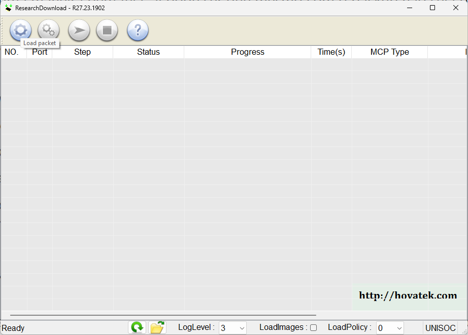

6. Selecione o arquivo .pac referente ao seu aparelho.

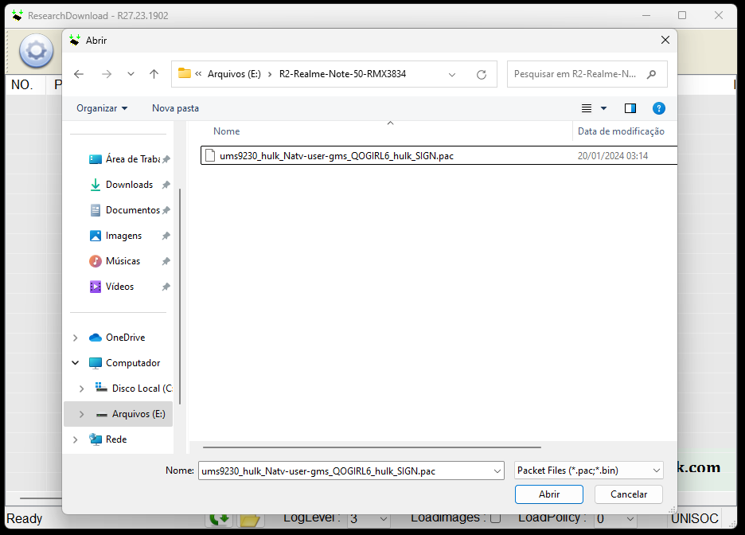

7. Agora espere a ferramenta da UNISOC carregar o software, pode demorar um pouco.
8. Dependendo, após carregado, pode ser que a ferramenta peça informações sobre a variante do seu aparelho, selecione a referente ao aparelho.
9. Selecione "Settings" (normalmente o segundo ícone contendo duas engrenagens).

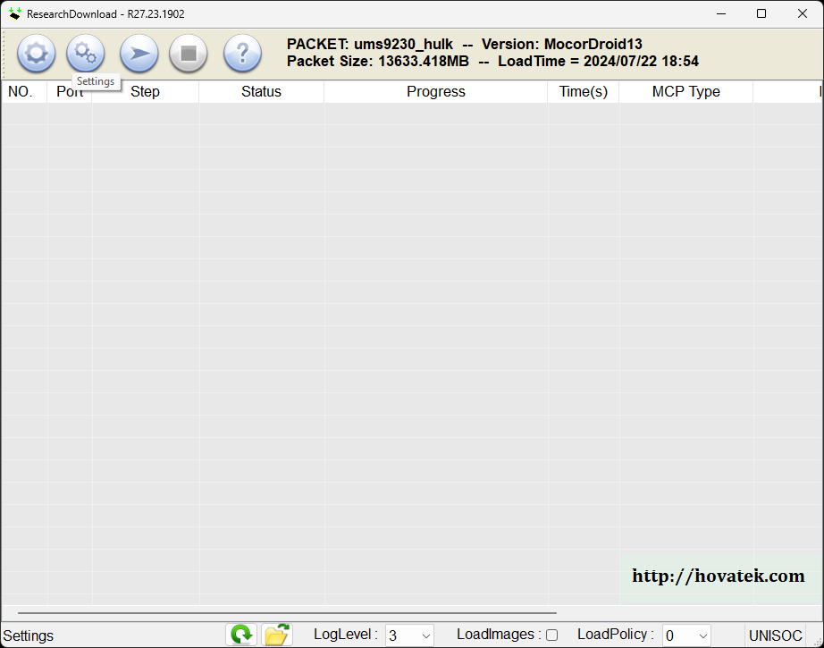

10. Nesta tela, em "Main Page", podemos selecionar partições para serem escritas do arquivo do software selecionado para o dispositivo, como não queremos flashar nada, iremos desmarcar todas as caixas da coluna "FileID", menos o "FDL1" e "FDL2" que são necessárias obrigatoriamente para inicialização do protocolo; Para facilitar as coisas, você pode selecionar a opção "Select All Files", e depois "de-selecionar" para desmarcar tudo de uma vez.

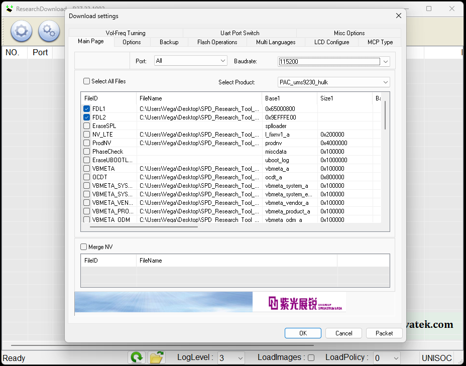

*O print não coube tudo, mas é para desmarcar TUDO, lembre-se de utilizar a rodinha do mouse para desmarcar todas as caixas, menos FDL1 e FDL2.*

11. Depois, navegue até a aba "Flash Operations", selecione "Active Read Flash", e na coluna "SN", marque todas as caixinhas, menos aquelas que em "size" estiverem escritas "0xFFFFFFFF" (normalmente a userdata, mas podem ser mais dependendo do aparelho).

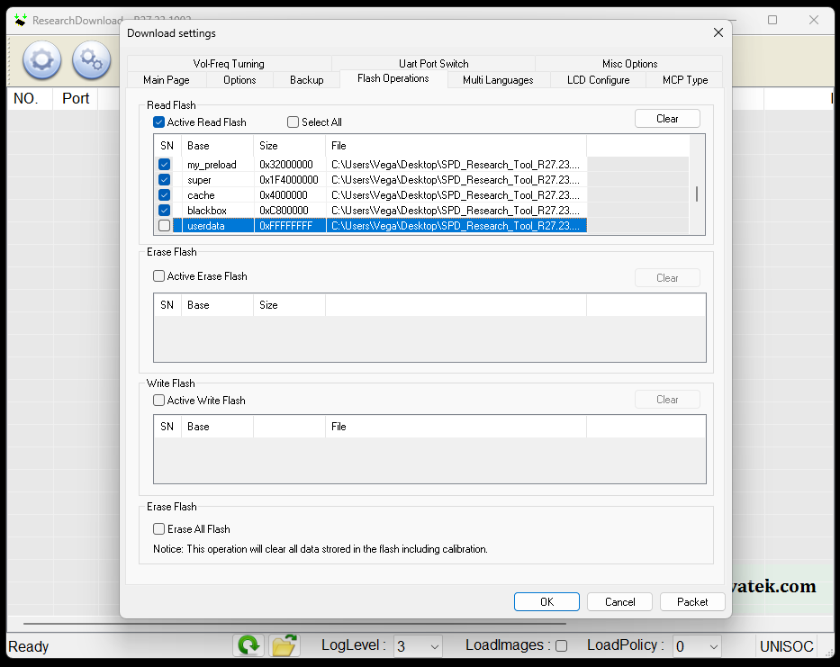

12. Feito, selecione "OK" e marque a opção de "Start downloading".
13. Agora inicie o aparelho no modo download, no realme Note 50 (e em alguns outros aparelhos com UNISOC) é só desligar o aparelho, com o dispositivo desligado, mantenha pressionado o botão de diminuir volume e plugue o cabo USB, quando a ferramenta reconhecer o aparelho, você já pode tirar os dedos do botão de diminuir volume.
14. Aguarde a ferramenta fazer backup do software do seu aparelho, pode demorar um pouco.

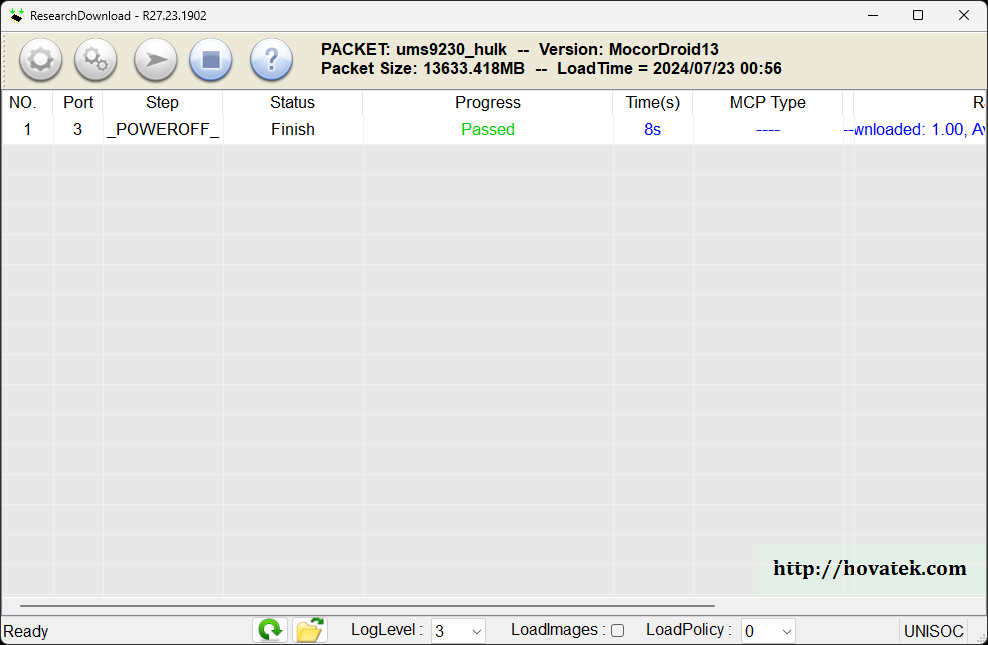

15. Finalizado, navegue até a pasta do Research, lá vai ter uma nova pasta, chamada de "ReadFlash", e todo o backup do software foi salvo nesta pasta, pegue esses arquivos e salve em algum lugar, talvez seja necessário no futuro.

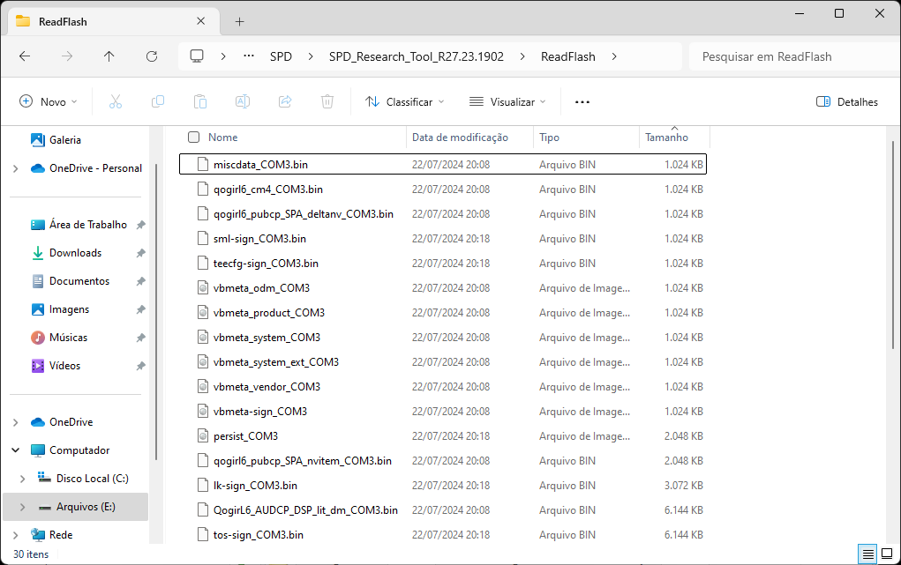

*Caso queira restaurar seu backup, tenha em mente que as partições "ProdNV/prodnv" e "Persist/persist" são partições persistentes, e NÃO PODEM SER COMPARTILHADAS/FLASHADAS EM OUTROS APARELHOS A NÃO SER O SEU PRÓPRIO!! Elas podem conter informações específicas da unidade do seu aparelho, como calibração de sensores e outras coisas específicas da sua unidade, o flash delas em outros dispositivos do mesmo modelo, pode causar problemas.*

*A partição "nv_lte/l_fixnv" pode conter dados sobre a base de banda (baseband) e possivelmente outras coisas, e é uma partição que pode ser atualizada parcialmente, NÃO COMPARTILHE O BACKUP E NEM FLASHE O BACKUP DO FIX_NV DE UM APARELHO EM OUTRO.*

*Este é um backup apenas do Software, não inclui o armazenamento interno.*

16. No Research Download, selecione o botão de parar "Stop downloading", tem que parar para poder fechar o programa sem erros.

17. Após o backup, o aparelho é desligado automaticamente, caso queira ligar o aparelho, apenas pressione o botão power.

---

### Desbloqueio do bootloader

Desbloquear o bootloader é relativamente fácil utilizando está ferramenta de desbloqueio alternativo [unlock_bootloader](https://github.com/TomKing062/CVE-2022-38694_unlock_bootloader).

**O desbloqueio de bootloader vai formatar/resetar o aparelho!!**

1. Vá para a aba "Releases", procure pela versão mais recente, e baixe a ferramenta referente ao seu aparelho (no nosso caso, o realme Note 50).

	**Caso queira fazer o procedimento de desbloqueio de bootloader em outro aparelho com UNISOC, e seu aparelho não for suportado pela ferramenta de desbloqueio de bootloader alternativo comentada aqui, NÃO UTILIZE ESSA FERRAMENTA PARA DESBLOQUEAR O BOOTLOADER, E NÃO TENTE, EM HIPÓTESE ALGUMA, TENTAR DESBLOQUEAR O BOOTLOADER UTILIZANDO UMA FERRAMENTA DE UM DISPOSITIVO DIFERENTE, VAI DAR RUIM, NO PIOR DOS CASOS, PODE BRICKAR!!!*

2. Com a ferramenta de desbloqueio salva, extraia todos os arquivos numa pasta do seu computador.

3. Desligue o dispositivo.

4. **Verifique se o Research Download Tool está aberto, se estiver, FECHE-O.**

5. Abra a pasta da ferramenta e rode o "unlock".

6. Um janela do prompt de comando será mostrada, quando ela aparecer, ligue o aparelho no modo download e plugue no computador (com o aparelho desligado, mantenha o botão de diminuir volume pressionado e plugue o cabo USB), quando a ferramenta de desbloqueio de bootloader detectar o aparelho, já pode parar de pressionar o botão de diminuir volume.

7. Siga o passo a passo da ferramenta pela linha de comando, o texto vem em inglês, recomendo traduzir para evitar problemas, mas normalmente, caso a ferramenta não informe nenhum erro em específico, tem que ir digitando "yes" para confirmar as operações.

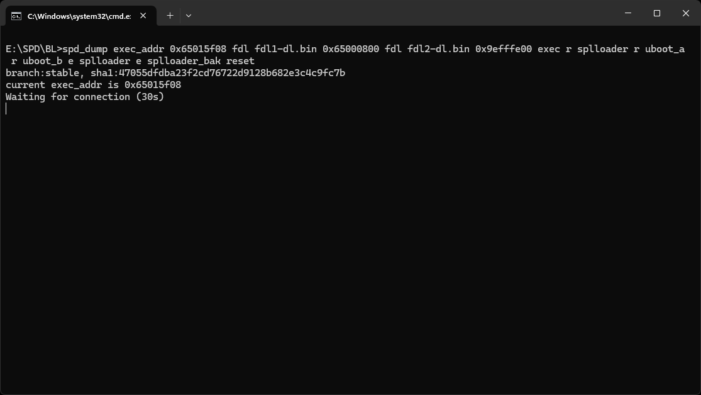

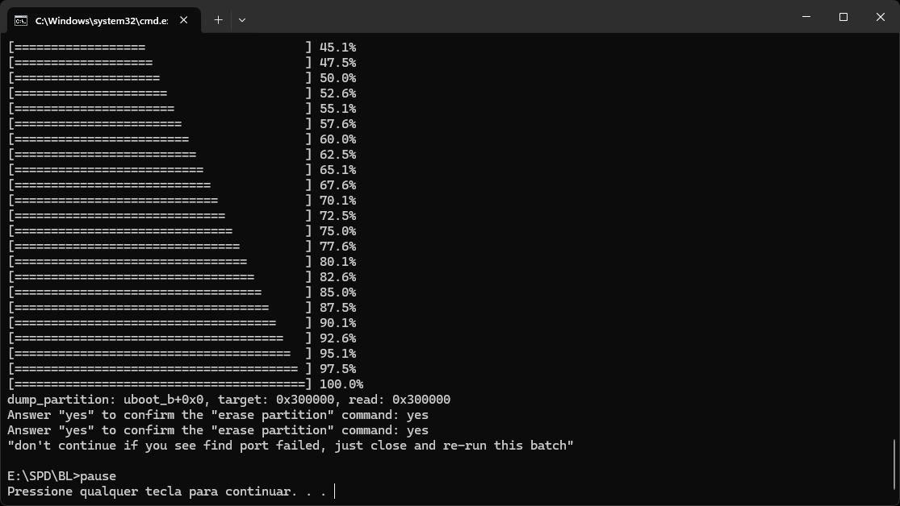

8. Finalizado, seu bootloader estará desbloqueado.

9. Inicie o aparelho e verifique se na inicialização aparece uma mensagem falando sobre "LOCK FLAG IS: UNLOCK", se aparecer, é porque o bootloader foi desbloqueado.

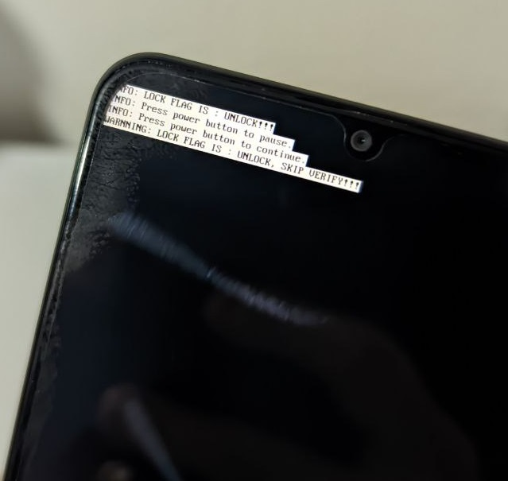

---

### Root com Magisk

Após o desbloqueio de bootloader, root com o Magisk é relativamente simples.

**Sobre o root com o Magisk:**
 - **Requer bootloader desbloqueado.**
 - **Vai formatar/resetar o aparelho.**

--

1. Você fez backup do software como mostrado no começo deste guia? Se sim, pegue a imagem de "boot.img" do seu backup e transfira para o armazenamento interno do seu smartphone.

	*se você ainda não fez um backup, FAÇA, **É ESSENCIAL TER UM BACKUP!!!!***

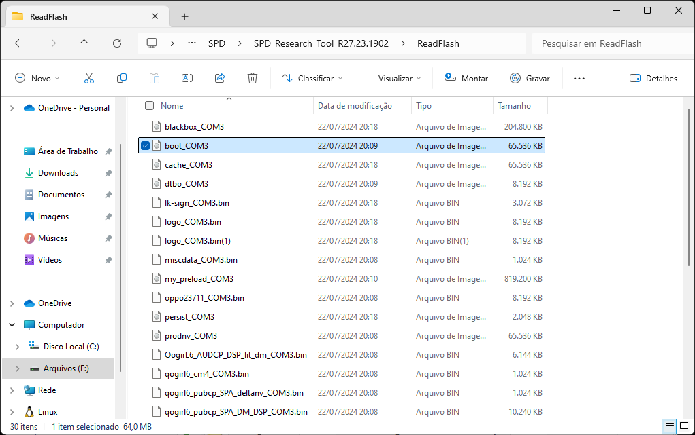

2. Baixe e instale a versão estável mais recente do [Magisk](https://github.com/topjohnwu/Magisk) no seu smartphone.

	*Caso for baixar pelo GitHub releases, as versões com a etiqueta "Pre-release” são referentes a versão de testes do Magisk, opte pela versão estável mais recente, elas normalmente têm a etiqueta verde escrita "Latest”*

3. Abra o Magisk, selecione a opção de "Install", selecione "Select a file…" (Selecione um arquivo para corrigir, alguma coisa assim), e procure pela "boot.img" transferida do seu backup para o smartphone, e marque para "continuar".

4. Agora o Magisk vai pegar a "boot.img" informada e vai gerar, a partir dela, uma nova "boot.img" incluindo o Magisk (para trazer o root), essa nova "boot.img" normalmente é salva dentro da pasta Downloads, com o nome de "magisk_algumacoisa.img", pegue esse arquivo, e transfira do seu smartphone para o computador.

5. Com a boot.img contendo o Magisk no PC, precisamos escrever esse arquivo na partição boot do aparelho, para isso, iremos utilizar novamente o Research Download, então desligue o smartphone.

6. Abra o Research Download, carregue o ".pac" (Load packet) referente ao seu dispositivo

	*Caso já esteja com o Research Download aberto de algum uso anterior, recomendo fechar, abrir, e carregar o ".pac" novamente para evitar problemas.*

7. Vá nas configurações (Settings), em "Main Page", desmarque TODAS as opções, deixando apenas 3 habilitadas, "FDL1", "FDL2" e "BOOT".

8. Na linha onde a opção "BOOT" estiver marcada, vai ter um caminho de arquivo, por padrão, o programa configura para escrever a partição de boot presente no arquivo pac, como queremos fazer root com o arquivo boot gerado pelo Magisk, iremos trocar esse caminho, clique duas vezes no texto do caminho, e clique nos três pontinhos e procure pela arquivo boot do gerado pelo Magisk.

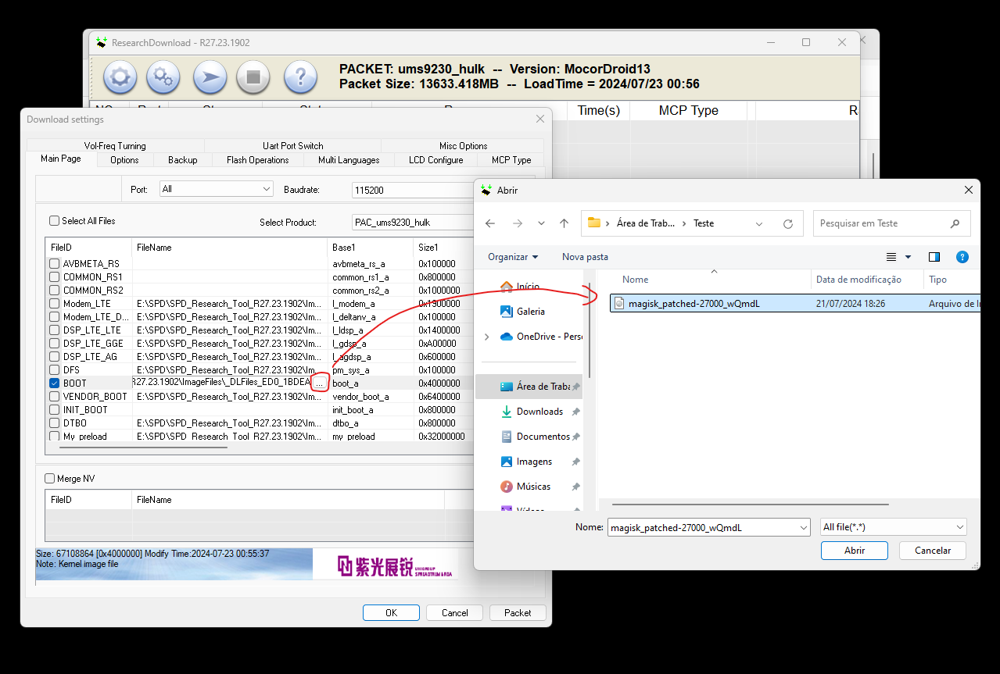

9. Certifique-se de que somente "FDL1", "FDL2" e "BOOT" estão marcados, e selecione "OK" e depois selecione "Start downloading".

10. Ligue o aparelho no modo download e plugue no computador (com o aparelho desligado, mantenha o botão de diminuir volume pressionado e plugue o cabo USB, quando o Research reconhecer o aparelho, pode parar de pressionar o botão de diminuir volume), após plugado, a ferramenta deverá iniciar o processo de flash, pode demorar um pouco.

11. Finalizado, "des-plugue” o aparelho.

12. Para evitar problemas, eu recomendo fazer uma formatação do aparelho após o root com Magisk (creio eu não ser necessário, mas acho melhor para evitar problemas).

13. Inicie o aparelho no modo recovery, no realme Note 50 é bem simples, pressione o botão POWER, depois de 3 segundos, pressione o botão de diminuir volume, e mantenha ambos botões pressionados até aparecer a tela da fabricante.

14. No recovery, será mostrado um robozinho do Android escrito "No command", mantenha pressionado o botão power, e toque uma única vez no botão de aumentar volume, quando o menu do recovery for mostrado, já pode parar de pressionar o botão power.

15. No recovery, a navegação é feita pelos botões, "VOL +" navega para cima, "VOL -" navega para baixo, "POWER" para selecionar uma opção, aqui, iremos navegar para a opção de "Wipe data/factory reset", seleccionado, marque "Factory data reset" para resetar/formatar o aparelho, depois navegue  pelo "Wipe cache partition", selecione, e marque "Yes" para formatar a partição de cache.

16. Finalizado, reinicie o aparelho marcando a opção de "Reboot system now".

17. Aparelho reiniciado, faça a configuração inicial e verifique se o aplicativo do Magisk é instalado automaticamente, caso contrário, faça a instalação aplicativo do Magisk.

18. Aparelho iniciado, abra o aplicativo do Magisk, ele vai pedir uma configuração, selecione "OK", o aparelho vai reiniciar.

19. Pronto, você está com root do Magisk!

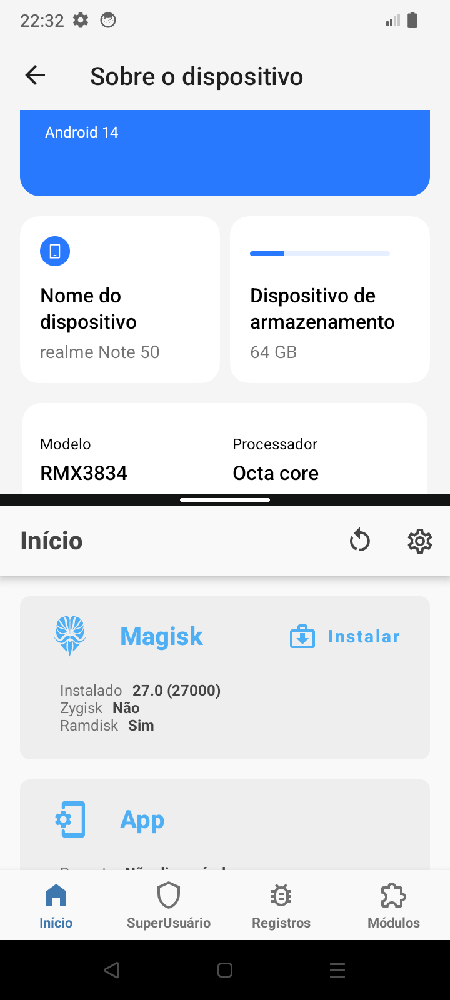

---

### Instalação de GSIs

Instalar GSIs nesse aparelho não é muito diferente de instalar GSIs em outros aparelhos.

**Para instalar GSIs, você vai precisar de:**
 1. **Uma GSI de sua escolha, o realme Note 50 é compatível com GSIs arm64 ab.**
 2. **SDK Platform Tools (você vai precisar basicamente do fastboot).**
 3. **Bootloader desbloqueado.**

**Trocar o sistema utilizando GSI requer uma formatação/reset do aparelho**

*Utilize apenas GSIs referente a versão atual do Android do aparelho ou mais recente, GSIs de versões anteriores podem não funcionar*

Com o aparelho com o bootloader desbloqueado, com o fastboot instalado no computador, e com uma GSI compatível de sua escolha também salva no computador, podemos seguir com a instalação da GSI.

1. Muitas GSIs vêm num formato compactado, ".zip", ".gz", ".xz" e outros…, caso a GSI vier em algum desses formatos, extraia, o que você precisa é do arquivo de imagem ".img".
2. Reinicie o aparelho no modo fastbootd (com o aparelho desligado, inicie no modo recovery, lá, selecione "Enter fastboot").
3. Plugue o smartphone no computador.
4. Abra o prompt de comando, e escreva "fastboot flash system ", agora precisamos especificar o caminho da GSI que a gente quer escrever no aparelho, para facilitar as coisas, depois do espaço, você pode arrastar a GSI no formato ".img" para o prompt de comando, ao fazer isso, o caminho da GSI deverá ser preenchido, o comando deve ficar algo como "fastboot flash system C:\algum\caminho\do\seu\computador\system-arm64-ab.img".
5. Aperte Enter para escrever a GSI na partição do sistema do aparelho.

*Caso o comando falhar, falando alguma coisa sobre "sem espaço", "cannot resize partition", alguma coisa do tipo, você pode tentar deletar a partição product para liberar espaço nas partições do sistema, já que a partição product não é utilizada enquanto se utiliza uma GSI, o comando para deletar a partição product é: `fastboot delete-logical-partition product_a` e `fastboot delete-logical-partition product_b`, após deletar, tente rodar o comando de flash novamente.*

6. Finalizado, no modo fastbootd, marque "Enter recovery"
7. No recovery, vamos formatar/resetar o aparelho, marcando "Format data/factory reset" e "Format data reset", e depois "Wipe cache partition" e "Yes" novamente.
8. Selecione "Reboot system" e verifique se a GSI iniciou corretamente.

---

### Restauração do software original

**Restaurar o software original vai formatar/resetar o aparelho**

Para restaurar o software original, iremos utilizar as mesmas ferramentas utilizadas no processo de backup do software, tenha os drivers da UNISOC instalados em sua máquina, o SPD Research Download Tool, e o arquivo ".pac" referente ao dispositivo.

1. Abra o SPD Research Download Tool
2. Carregue o ".pac" referente ao seu dispositivo ("Load packet", normalmente é o ícone da engrenagem, e selecione o arquivo ".pac".

   *Selecione a variante do seu aparelho caso necessário*

3. Selecione "Settings" (normalmente é o ícone com duas engrenagens).
4. Aqui, na aba "Main Page" desmarque somente "prodnv" e "persist".
5. Vá até a aba "Backup” e verifique se em "File Backup” todas as opções estão marcadas (marque-as caso não estejam marcadas).
6. Selecione "OK", e toque no botão de "Start download".
7. Inicie o aparelho no modo download e plugue o smartphone no computador.
8. Aguarde o flash terminar, pode demorar um pouco.
9. Finalizado, desplugue o smartphone e pressione o botão power para iniciar o aparelho.
10. Verifique se o software do aparelho foi restaurado.

---

### Bloqueio do bootloader

**Bloquear o bootloader requer que o software original seja restaurado, requer acesso ao fastboot e restaurar o software original vai formatar/resetar o aparelho.**

1. Restaure o software original (restaure, caso contrário, o smartphone não vai iniciar o sistema operacional após o bloqueio do bootloader).
1. Inicie o aparelho no modo fastboot (bootloader).
2. Plugue o smartphone no computador.
3. Utilize o seguinte comando para bloquear o bootloader: `fastboot flashing lock`.
4. Toque no botão de diminuir volume para confirmar o bloqueio do bootloader
5. Reinicie o aparelho forçando uma reinicialização, ou reinicie utilizando o comando `fastboot reboot`.

---

### Problemas

Ao mexer no software deste aparelho, confesso que tive diversos problemas, e creio eu que alguns de vocês também podem ter, então criei essa sessão no guia, vai pode ser útil para alguém.

--

Baseband como unknown? sem sinal por conta disso?

O problema disso pode ser várias coisas, eu mesmo experienciei isso duas vezes, e eram dois casos diferentes, eu estava aprendendo a utilizar a ferramenta do Research, e por distração acabei apagando a fix_nv, sem fix_nv, sem baseband, nesse caso eu fui sortudo, porque eu tinha feito um backup completo antes de testar as coisas, aí eu só restaurei a partição fix_nv mesmo (fiz a restauração pelo fastbootd com o bootloader desbloqueado, não consegui flashar pelo Research), já na segunda vez, foi quando eu estava testando o downgrade, a baseband do Android 14 não funciona no Android 13, ai vai dar baseband unknown mesmo.

--

Conseguiu "brickar" o celular e agora ele tá travado na tela da realme?

Também fiz isso várias vezes kk, principalmente testando GSI, nesses casos, infelizmente, o único jeito é subir o aparelho no modo download forçadamente (comentei sobre isso lá no começo deste guia, nos modos de inicialização), plugar no PC, e restaurar o software original.

--

Como escrever uma partição pelo Research Download?

Similar ao procedimento de fazer root com o Magisk, é só abrir o Research Download, carregar o ".pac" do seu smartphone, ir em "Settings", e em "Main Page", desmarque tudo, marque apenas o "FDL1" e "FDL2" que são necessários para o funcionamento do protocolo, depois, marque a partição que você quer escrever, e na coluna "FileName" referente a partição marcada, dê dois clicks, e selecione os "..." para selecionar um arquivo, selecione o arquivo que você quer flashar na partição desejada, toque em "OK" e ja era, "Start downloading", plugue o smartphone no computador no modo download, que o arquivo será flashado na partição informada, utilizei isso bastante para restaurar partições feitas pelo backup.
